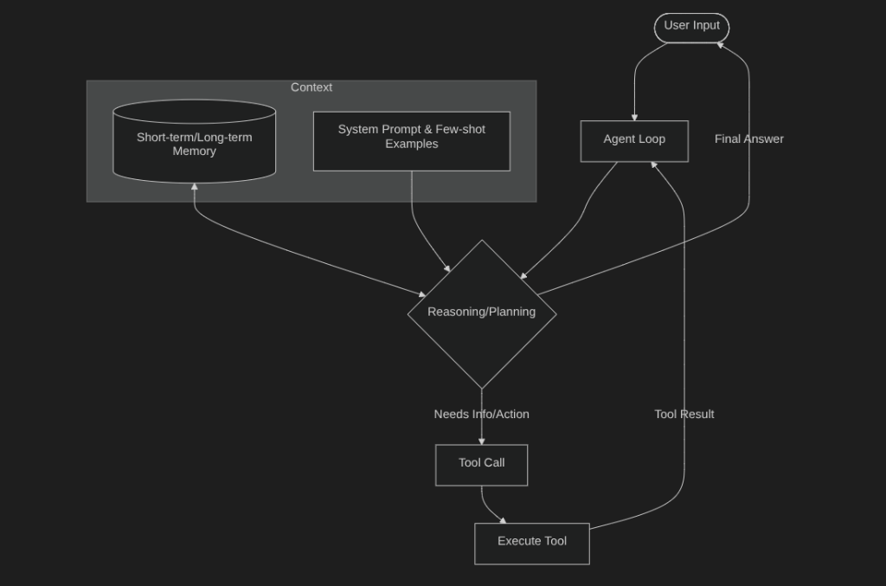
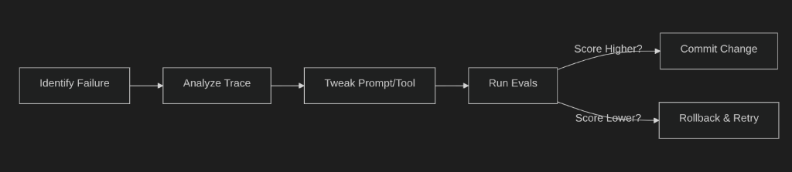

# AI Agent Boilerplate (EDD Architecture)

A modular, lightweight AI Agent framework built from scratch using the official **Google GenAI Python SDK**. This project uses a custom **Perceive-Plan-Act** reasoning loop, tool execution registry, and an automated evaluation suite to practice **Evals-Driven Development (EDD)**.

---

## 🏗️ Core Architecture

### Agentic Loop Workflow


### Directory Structure
The repository is structured following professional AI engineering patterns:

```text
├── config/
│   └── settings.py          # Configuration manager (.env loader, temperature, step limits)
├── core/
│   ├── agent.py             # The core agent execution loop (ReAct loop, state tracker)
│   ├── llm.py               # Wrapper client for official google-genai SDK
│   └── prompts.py           # System prompts governing agent tone & instruction
├── tools/
│   ├── __init__.py          # Tool registration & exports
│   ├── web_search.py        # Mocked web search for deterministic testing
│   └── calculator.py        # Python calculation tool with GenZ slang output
├── evals/
│   ├── dataset.json         # Golden dataset of test cases (inputs vs expected outcomes)
│   └── run_evals.py         # Automated evaluation script (measures accuracy, latency, and cost)
├── requirements.txt         # Project dependencies
└── main.py                  # CLI entry point to chat with the agent
```

---

## ⚡ Features

1. **Custom Agent Loop**: Fully visible reasoning execution step-by-step. It doesn't hide execution traces.
2. **Deterministic Mock Tools**: Includes mock web search and a calculator. This guarantees tests are reproducible and unaffected by changing search results.
3. **Evals-Driven Development (EDD)**: An automated runner that grades the agent on:
   * **Tool Routing Accuracy**: Did it call the correct tools in sequence?
   * **Semantic/Keyword Match**: Does the final response contain the expected keywords?
4. **Performance & Token Monitoring**: Tracks token consumption (input vs output) and execution latency for cost-optimization.

---

## 🧪 Harness Engineering (Simple Explanation)

Harness engineering means building a safe and repeatable way to test your agent.

In this project, the "harness" is the eval setup (`evals/dataset.json` + `evals/run_evals.py`):
- You give fixed test inputs.
- You define what good output should look like.
- You run checks automatically after every change.

This makes improvement easier because you can quickly see what got better and what broke.

---

## 🧠 Lesson: What Is a Context Window?

A **context window** is the amount of text an AI model can "see" at one time (your prompt, instructions, tool outputs, and recent conversation).

- If important details fit inside the context window, the model can use them.
- If the conversation gets too long, older details may fall out of the window and be forgotten.

In simple terms: bigger context window = better memory for longer tasks.

---

## 🚀 Getting Started

### 1. Installation

Clone the repository and set up a virtual environment:

```bash
git clone <your-github-repo-url>
cd AI_Agents
python3 -m venv .venv
source .venv/bin/activate
pip install -r requirements.txt
```

### 2. Environment Configuration

Copy the template environment file:

```bash
cp .env.template .env
```

Open `.env` and fill in your Gemini API key from [Google AI Studio](https://aistudio.google.com/):

```env
GEMINI_API_KEY=your_actual_api_key_here
```

### 3. Run the Agent Interactively

Start the CLI to run prompts manually and inspect how the agent plans and calls tools:

```bash
python main.py
```

### 4. Run the Evaluation Suite

Test your agent against the regression test cases and check the latency/token metrics:

```bash
python evals/run_evals.py
```

---

## 🎯 How to Iterate & Make the Agent Better



To improve your agent:
1. Run the evaluations (`python evals/run_evals.py`).
2. Identify which test cases are marked as `❌ FAIL`.
3. Read the logs in `logs/eval_results.json` to understand the root cause:
   * **Wrong Tool**: Tweak docstrings in `tools/` to clarify when the tool should be used.
   * **Wrong Output**: Update instructions in `core/prompts.py` to give the model stricter guidelines or few-shot examples.
4. Re-run evaluations to verify the success rate improves without regressions.
